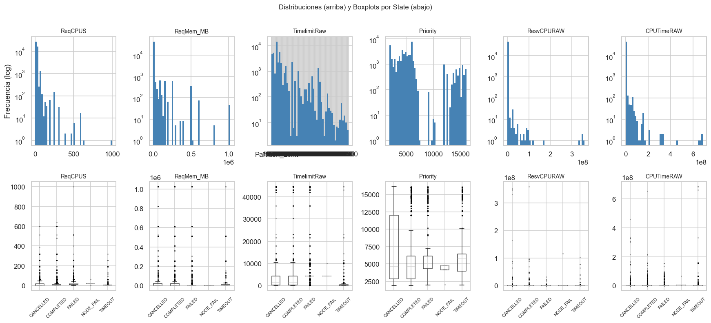

**Integrantes y carnes**

| Integrante | Carne |
|---|---:|
| Daniel Garbanzo | 2022117129 |
| Luis Carlos Navarro Todd | 2022212158 |
| Ricardo Shum Estrada | 2017144193 |

**Algoritmo:** k-Nearest Neighbors (kNN) desde cero  
**Dataset:** Historial de trabajos del cluster Kabre de CeNAT/CONARE  
**Fuente del dataset:** `dataset.csv` del repositorio Project-1-CeNAT  
**Entregable base:** `kabre_jobs_xai.ipynb`

# 1. Introduccion

Los clusters de computo de alto rendimiento (HPC) son infraestructuras compartidas donde muchos usuarios envian trabajos con requerimientos variables de CPUs, memoria, nodos, prioridad, tiempo limite y colas de ejecucion. En este entorno, una configuracion inadecuada no solo incrementa la probabilidad de fallo, sino que tambien consume recursos de computo, tiempo de cola y esfuerzo de investigacion sin producir un resultado util. En Kabre, operado por CeNAT/CONARE, este problema tiene relevancia directa porque el historial de ejecuciones muestra que una proporcion considerable de jobs no termina exitosamente.

El objetivo de este proyecto fue construir, desde cero, un sistema basado en k-Nearest Neighbors (kNN) capaz de responder dos preguntas practicas: primero, si un trabajo nuevo tiene alta o baja probabilidad de completarse exitosamente; segundo, que cambios en su configuracion podrian aumentar esa probabilidad. La pregunta analitica que guio el trabajo fue la siguiente: **"Es posible predecir con precision razonable si un trabajo en el cluster Kabre se completara exitosamente y, si no, que cambios especificos en su configuracion podrian aumentar esa probabilidad?"**

Se eligio kNN por tres razones principales. En primer lugar, permite una implementacion completamente desde cero usando operaciones elementales sobre vectores y distancias. En segundo lugar, su interpretacion geometrica es natural: la prediccion de un punto depende de trabajos historicamente similares en el espacio de caracteristicas. En tercer lugar, esta misma geometria favorece la construccion de explicaciones y recomendaciones contrafactuales, porque es posible identificar que variables acercan o alejan un job de ejemplos que si terminaron como `COMPLETED`.

El entregable principal del proyecto se organizo bajo la metodologia CRISP-DM. En el notebook se desarrollaron las fases de entendimiento del negocio, entendimiento de los datos, preparacion, modelado, evaluacion y conclusiones. El informe sintetiza ese proceso con enfasis en la implementacion algebraica del modelo, los hallazgos del analisis exploratorio, el desempeno del clasificador y la interpretacion critica de sus recomendaciones.

# 2. Marco teorico

## 2.1 k-Nearest Neighbors como clasificador basado en instancias

El algoritmo kNN clasifica una observacion nueva a partir de las etiquetas de las `k` observaciones mas cercanas del conjunto de entrenamiento. A diferencia de otros modelos, no construye una funcion parametrica explicita durante el entrenamiento; en su forma mas simple, conserva los datos ya procesados y decide por vecindad local. Esta propiedad lo convierte en un metodo de *lazy learning* o aprendizaje perezoso y hace que su comportamiento dependa fuertemente del espacio de caracteristicas definido para el problema (Cover & Hart, 1967; Hastie, Tibshirani, & Friedman, 2009).

Sea un vector de entrada $x \in \mathbb{R}^d$ y un conjunto de entrenamiento $\{(x_i, y_i)\}_{i=1}^n$. El clasificador busca los `k` vecinos mas cercanos de $x$ segun una metrica de distancia y luego asigna la clase mas frecuente entre ellos:

$$
\hat{y}(x) = \operatorname{mode}\{y_{(1)}, y_{(2)}, \dots, y_{(k)}\}
$$

donde $y_{(j)}$ representa la etiqueta del vecino $j$-esimo mas cercano.

En notacion matricial, el conjunto procesado puede verse como una matriz de datos

$$
X \in \mathbb{R}^{n \times d}
$$

y un vector de etiquetas binarias

$$
y \in \{0,1\}^{n}
$$

donde en este trabajo se obtiene finalmente una matriz aproximada de tamano $42745 \times 15$.

## 2.2 Normalizacion y construccion del espacio de caracteristicas

En kNN, la cercania entre puntos solo tiene sentido si las variables se encuentran en escalas comparables. Si una feature posee magnitudes mucho mayores que otra, dominara la distancia total aunque su importancia real no sea superior. Por esta razon, el proyecto aplico normalizacion min-max a las variables numericas:

$$
x' = \frac{x - x_{\min}}{x_{\max} - x_{\min}}
$$

La normalizacion transforma cada variable al intervalo $[0, 1]$ y evita que columnas como memoria, prioridad o tiempo limite distorsionen el calculo de similitud. Ademas, las variables categoricas se representaron mediante *one-hot encoding*, lo que permite incorporarlas como dimensiones independientes dentro del vector de entrada (Han, Kamber, & Pei, 2012).

## 2.3 Distancias L2 y L1

El proyecto implementa dos distancias desde cero. La principal para el modelo final fue la distancia euclidiana o norma L2:

$$
\lVert x - z \rVert_2 = \sqrt{\sum_{j=1}^{d}(x_j - z_j)^2}
$$

Esta distancia penaliza con mayor fuerza diferencias grandes en una o varias coordenadas y es una opcion natural cuando las features ya fueron normalizadas.

Tambien se implemento la distancia Manhattan o norma L1:

$$
\lVert x - z \rVert_1 = \sum_{j=1}^{d} |x_j - z_j|
$$

La distancia L1 puede ser util cuando se desea una medida menos sensible a grandes discrepancias puntuales. Aunque el modelo final del notebook usa L2, la implementacion de L1 forma parte del analisis algebraico exigido por el curso y deja abierta la puerta a comparaciones futuras.

## 2.4 Recomendaciones contrafactuales y recourse

Una prediccion negativa es mas util si puede acompanarse de una recomendacion accionable. En este proyecto se adopta la idea de *algorithmic recourse*: generar cambios en las variables de entrada que acerquen una observacion a la region del espacio asociada con la clase favorable (Karimi, Barthe, Scholkopf, & Valera, 2022). En lugar de solo indicar "este trabajo podria fallar", el sistema intenta sugerir modificaciones concretas en memoria, prioridad, nodos o colas de ejecucion para aumentar la probabilidad predicha de `COMPLETED`.

La propuesta implementada en el notebook usa una busqueda codiciosa sobre features modificables. En cada iteracion se evalua cual cambio incremental produce la mayor mejora en la probabilidad predicha de la clase objetivo. Aunque esto no produce garantias causales, si ofrece una forma interpretable de orientar decisiones operativas antes del envio del job.

# 3. Descripcion del dataset

## 3.1 Origen y contexto real

El dataset corresponde a trabajos reales ejecutados en el cluster Kabre de CeNAT/CONARE durante 2024. Los registros provienen del historial del scheduler Slurm, sistema de administracion y asignacion de recursos ampliamente utilizado en entornos HPC (Yoo, Jette, & Grondona, 2003). El uso de un dataset operativo da al proyecto una relevancia practica clara, pues las predicciones se formulan sobre decisiones reales de uso del cluster.

En su estado bruto, el dataset contiene **46,744** filas y **12** columnas principales. Entre ellas se encuentran variables numericas como `ReqCPUS`, `ReqNodes`, `ResvCPURAW`, `Priority` y `CPUTimeRAW`, asi como variables categoricas y mixtas como `Partition`, `QOS`, `State`, `ReqMem` y `TimelimitRaw`. La fecha de envio se registra en la columna `Submit`, que permite derivar patrones temporales.

## 3.2 Limpieza y preparacion inicial

El notebook registra **3,249** valores nulos totales y **824** duplicados antes de la limpieza. Tras eliminar nulos y registros duplicados, el conjunto queda en **42,745** filas sin datos faltantes ni repetidos. Este paso fue necesario para garantizar consistencia en el calculo de distancias, ya que kNN no tolera adecuadamente registros incompletos sin un tratamiento explicito.

Tambien se detectaron dos necesidades de transformacion especificas:

1. `TimelimitRaw` contiene valores no numericos en algunos casos, por lo que se construyo `TimelimitSec` a partir de reglas asociadas a la particion.
2. Las particiones originales presentan alta cardinalidad y fuertes diferencias de comportamiento, por lo que se agruparon en cinco familias principales: `Andalan`, `Nu`, `Dribe`, `Nukwa` y `Kura`.

La siguiente tabla resume las variables mas relevantes y su tratamiento en el pipeline:

| Variable | Tipo original | Tratamiento en el notebook | Uso final |
|---|---|---|---|
| `ReqCPUS` | Numerica | Se conserva | Feature numerica |
| `ReqMem` | Cadena | Se convierte a `ReqMem_MB` | Feature numerica |
| `ReqNodes` | Numerica | Se conserva | Feature numerica |
| `ResvCPURAW` | Numerica | Se conserva | Feature numerica |
| `TimelimitRaw` | Mixta | Se transforma a `TimelimitSec` | Feature numerica |
| `Priority` | Numerica | Se conserva | Feature numerica |
| `Submit` | Fecha-hora | Se derivan `submit_hour` y `submit_dow` | Features temporales |
| `Partition` | Categorica | Se agrupa como `PartitionGroup` | One-hot encoding |
| `QOS` | Categorica | Se conserva | One-hot encoding |
| `State` | Categorica | Se binariza en `COMPLETED` vs no completado | Variable objetivo |

Tambien es util resumir los estadisticos globales mas importantes del conjunto de trabajo:

| Indicador | Valor |
|---|---:|
| Registros brutos | 46,744 |
| Columnas base del dataset | 12 |
| Columnas del dataframe de trabajo tras transformaciones | 16 |
| Nulos originales | 3,249 |
| Duplicados originales | 824 |
| Registros finales utilizables | 42,745 |

## 3.3 Variable objetivo

La columna `State` describe el estado final del trabajo. Para el problema de clasificacion se transformo en una etiqueta binaria:

- `1` si `State == COMPLETED`
- `0` para `FAILED`, `CANCELLED` o `TIMEOUT`

La distribucion observada en el notebook fue la siguiente:

| Estado | Trabajos | Porcentaje |
|---|---:|---:|
| FAILED | 24,335 | 52.06% |
| COMPLETED | 16,782 | 35.90% |
| CANCELLED | 4,001 | 8.56% |
| TIMEOUT | 1,621 | 3.47% |

Este desbalance justifica el uso de metricas adicionales a `accuracy`, ya que un clasificador ingenuo que siempre prediga "no completado" alcanzaria aproximadamente **64.10%** de precision global solo por la distribucion de clases.

## 3.4 Hallazgos principales del analisis exploratorio

El EDA del notebook deja varios hallazgos relevantes:

- Solo alrededor del 36% de los trabajos terminan como `COMPLETED`, por lo que el problema tiene una clase positiva minoritaria.
- La tasa de exito cambia de forma importante entre particiones, lo que confirma que `Partition` es una feature informativa.
- Existen patrones temporales por hora del dia, lo cual justifica incluir `submit_hour` y `submit_dow` en el vector de entrada.
- La columna `TimelimitRaw` requiere tratamiento especial y no puede usarse directamente en todos los casos.
- Aunque existen outliers en variables como memoria, tiempo y prioridad, estos no se eliminaron porque reflejan comportamientos plausibles dentro de un entorno HPC real.

{fig-cap="Distribucion de la variable objetivo `State`." width=90%}

{fig-cap="Comportamiento de las variables categoricas `Partition` y `QOS`." width=95%}

{fig-cap="Distribuciones numericas y outliers por estado." width=95%}

{fig-cap="Patrones temporales de envio de trabajos." width=90%}

{fig-cap="Correlaciones entre variables numericas y la variable objetivo binaria." width=85%}

# 4. Implementacion

## 4.1 Construccion de la matriz de caracteristicas

Despues de la limpieza, el notebook construye una matriz `X` con **42,745** muestras utilizables y una etiqueta binaria `y` del mismo tamano. La implementacion actual representa cada job mediante un vector de **15 dimensiones efectivas**:

- 8 variables numericas: `ReqCPUS`, `ReqMem_MB`, `ReqNodes`, `ResvCPURAW`, `TimelimitSec`, `Priority`, `submit_hour`, `submit_dow`
- 5 columnas one-hot para `PartitionGroup`
- 2 columnas one-hot para `QOS`

Este paso materializa el concepto de vector de caracteristicas del curso y permite aplicar operaciones algebraicas y metricas de distancia de manera uniforme.

## 4.2 Division del dataset y normalizacion

El notebook divide los datos con un esquema estratificado de entrenamiento y prueba usando una proporcion **80/20**, preservando la distribucion aproximada de clases entre ambos subconjuntos. Posteriormente se ajusta un escalador min-max sobre el conjunto de entrenamiento y se transforma tanto `X_train` como `X_test` al rango $[0,1]$.

La normalizacion es esencial para kNN, porque el algoritmo compara puntos directamente en el espacio de caracteristicas. Sin este paso, variables de gran magnitud como memoria o prioridad dominarian la similitud total.

## 4.3 Implementacion desde cero del algoritmo kNN

La clase `KNNClassifier` del notebook se implementa sin usar `sklearn.fit()` ni equivalentes. La logica central incluye:

1. almacenamiento del conjunto de entrenamiento,
2. calculo vectorizado de distancias L2 o L1,
3. seleccion de los `k` vecinos mas cercanos mediante `argpartition`,
4. votacion mayoritaria para la clase final,
5. estimacion de probabilidades por proporcion de vecinos.

La implementacion tambien contempla una variante de vecinos ponderados mediante pesos inversamente proporcionales a la distancia:

$$
v_i = \frac{1}{d_i + \varepsilon}
$$

donde $\varepsilon = 10^{-9}$ evita divisiones por cero. Aunque el modelo final se ejecuto con `weighted=False`, esta extension muestra como el problema puede interpretarse en terminos de combinaciones lineales de etiquetas vecinas.

## 4.4 Explicabilidad y recomendaciones

Ademas de clasificar, el notebook implementa tres mecanismos de interpretacion:

1. **Vector decoding**, para volver del espacio normalizado a valores legibles por el usuario.
2. **Reason codes**, para estimar que features alejan un trabajo de la clase `COMPLETED`.
3. **Counterfactuals**, para proponer cambios concretos sobre variables modificables con el objetivo de mejorar la prediccion.

La generacion contrafactual se basa en una busqueda codiciosa. En cada paso se perturba una feature mutable y se conserva el cambio que produce la mayor ganancia en la probabilidad predicha de `COMPLETED`. Este procedimiento se repite hasta cruzar la frontera de decision o hasta agotar las iteraciones permitidas.

## 4.5 Comentarios de diseno

Desde el punto de vista de ingenieria, la implementacion privilegia claridad sobre optimizacion extrema. El algoritmo es suficientemente eficiente para demostrar el metodo en el dataset actual, pero no esta pensado como solucion de produccion para inferencia masiva en tiempo real. Esto es coherente con el objetivo del curso: explicitar el uso de algebra lineal, normas y representaciones vectoriales dentro de un algoritmo de aprendizaje automatico implementado manualmente.

## 4.6 Pseudocodigo del pipeline principal

El siguiente pseudocodigo resume la logica de implementacion usada en el notebook:

```text
Entrada: dataset crudo de trabajos del cluster Kabre
Salida: clasificador kNN, metricas de evaluacion y recomendaciones

1. Cargar dataset y tipificar columnas
2. Eliminar registros nulos y duplicados
3. Transformar ReqMem a MB y TimelimitRaw a TimelimitSec
4. Agrupar Partition en familias y codificar variables categoricas
5. Construir la matriz X y la etiqueta binaria y
6. Dividir en train/test con muestreo estratificado
7. Normalizar variables numericas con min-max usando solo train
8. Entrenar kNN almacenando X_train e y_train
9. Para cada punto de prueba:
   9.1 Calcular distancias a todos los puntos de entrenamiento
   9.2 Seleccionar los k vecinos mas cercanos
   9.3 Asignar clase por votacion mayoritaria
10. Calcular metricas manualmente
11. Generar reason codes y contrafactuales para casos no exitosos
12. Interpretar resultados en contexto del cluster
```

## 4.7 Fragmentos clave con anotaciones

### Construccion del vector de caracteristicas

```python
vec = [
    req_cpus,
    req_mem,
    req_nodes,
    resv_cpu,
    timelimit,
    priority,
    float(hour),
    float(dow),
    *one_hot(row["PartitionGroup"], PARTITION_GROUPS),
    *one_hot(row["QOS"], QOS_CATEGORIES),
]
```

Este fragmento es importante porque muestra la traduccion del problema real a un vector en $\mathbb{R}^{15}$. Las primeras ocho entradas son variables numericas y las restantes corresponden a las codificaciones one-hot de `PartitionGroup` y `QOS`.

### Distancia euclidiana por batch

```python
def _euclidean_batch(query: np.ndarray, X_train: np.ndarray) -> np.ndarray:
    diff = X_train - query
    return np.sqrt((diff * diff).sum(axis=1))
```

Aqui aparece de forma directa la norma L2 del curso. El uso vectorizado permite calcular la distancia entre un punto de consulta y todo el conjunto de entrenamiento en una sola operacion matricial por columnas.

### Seleccion de vecinos y decision final

```python
dists = self._distances(query)
k_idx = np.argpartition(dists, self.k)[: self.k]
k_idx = k_idx[np.argsort(dists[k_idx])]
return dists[k_idx], self._y[k_idx]
```

Este bloque implementa el nucleo de kNN: calcula todas las distancias, localiza los `k` vecinos mas cercanos y ordena esos vecinos por cercania. A partir de esta salida se construye la votacion mayoritaria o la probabilidad por proporcion de clases.

# 5. Resultados y analisis

## 5.1 Seleccion de `k`

El notebook reporta una validacion cruzada de 10 folds sobre varios valores de `k`. Los resultados mostrados son los siguientes:

| `k` | Accuracy | RMSE | F1 | AUC |
|---:|---:|---:|---:|---:|
| 3 | 0.8458 | 0.3926 | 0.8033 | 0.9750 |
| 5 | 0.8359 | 0.4050 | 0.7927 | 0.9718 |
| 10 | 0.8315 | 0.4105 | 0.7888 | 0.9705 |
| 25 | 0.8011 | 0.4459 | 0.7578 | 0.9601 |
| 50 | 0.7900 | 0.4582 | 0.7478 | 0.9564 |
| 100 | 0.7679 | 0.4817 | 0.7290 | 0.9493 |

Aunque `k=3` reporta la mayor `accuracy` y el mayor `AUC`, el notebook conserva **`k=10`** para la fase final y para la generacion de contrafactuales, argumentando un balance razonable entre cantidad de vecinos, suavizado y estabilidad local. Dado que el proyecto prioriza coherencia con el entregable principal y que volver a ejecutar la validacion cruzada tiene un costo alto, este borrador mantiene esa decision metodologica. En terminos de redaccion academica, esta debe presentarse como una decision metodologica del entregable principal, no como una nueva optimizacion realizada durante la preparacion del informe.

{fig-cap="Visualizacion de la validacion cruzada para distintos valores de `k`." width=92%}

## 5.2 Evaluacion final del clasificador

Con `k=10` y distancia euclidiana, el notebook reporta las siguientes metricas finales sobre el conjunto de prueba:

| Metrica | Valor |
|---|---:|
| Accuracy | 0.8329 |
| Precision | 0.7719 |
| Recall | 0.8130 |
| F1-score | 0.7919 |
| AUC-ROC | 0.9187 |

Estos resultados son claramente superiores al baseline ingenuo de predecir siempre "no completado" (aproximadamente 0.6410 de `accuracy`). En otras palabras, el modelo extrae senales utiles de la configuracion del job y no solo replica la clase mayoritaria. No obstante, el criterio de exito original del notebook exigia alcanzar al menos 0.90 de `accuracy`, por lo que ese objetivo estricto no se cumple.

El `AUC-ROC` de 0.9187 es particularmente importante, porque sugiere una buena capacidad de separacion entre trabajos completados y no completados a nivel de probabilidad. La combinacion de `precision`, `recall` y `F1-score` tambien muestra que el modelo logra un equilibrio razonable entre recuperar trabajos exitosos y evitar clasificaciones positivas excesivas.

{fig-cap="Matriz de confusion del conjunto de prueba." width=60%}

## 5.3 Analisis de recomendaciones contrafactuales

El notebook aplica el procedimiento de recomendaciones sobre una muestra de trabajos no completados del conjunto de prueba. El resumen reportado es el siguiente:

| Metrica | Valor |
|---|---:|
| Muestra analizada | 1000 |
| Casos descartados porque el modelo ya predice `COMPLETED` | 854 |
| Casos procesados | 146 |
| Tasa predicha `COMPLETED` despues | 36.99% |
| Cambio absoluto en tasa | 36.99% |
| Counterfactual encontrado | 33.56% |
| Ganancia promedio `P(COMPLETED)` | 0.1384 |

Dos observaciones son clave. Primero, el metodo si encuentra sugerencias accionables para una fraccion relevante de jobs problematicos, lo que refuerza el valor practico del sistema como apoyo previo al envio. Segundo, existe una brecha visible entre el resultado historico real y la clasificacion del modelo: muchos jobs historicamente no completados ya eran clasificados como `COMPLETED` por el modelo. Esto obliga a interpretar las recomendaciones como una aproximacion orientativa y no como una garantia causal.

## 5.4 Variables mas frecuentes en las recomendaciones

Los cambios sugeridos mas frecuentes en la muestra procesada fueron:

| Feature | Conteo | Porcentaje |
|---|---:|---:|
| `Priority` | 33 | 22.60% |
| `ReqMem_MB` | 14 | 9.59% |
| `ReqCPUS` | 1 | 0.68% |
| `ReqNodes` | 1 | 0.68% |

Esto sugiere que las politicas de prioridad y la asignacion de memoria son las variables sobre las cuales el modelo encuentra con mayor frecuencia oportunidades de mejora dentro de su propia frontera de decision. Desde una perspectiva operativa, estas variables merecen atencion especial cuando un usuario recibe una advertencia de alto riesgo.

{fig-cap="Features mas bloqueantes segun reason codes agregados." width=80%}

## 5.5 Analisis critico

Los resultados muestran que el sistema es util, pero tambien revelan sus limites. No alcanza el umbral de 90% de `accuracy` fijado al inicio del notebook, por lo que no puede presentarse como solucion cerrada. Sin embargo, comparado con un baseline ingenuo y considerando el valor del `AUC-ROC`, si puede defenderse como un asistente predictivo razonable para apoyar decisiones de configuracion.

La parte mas innovadora del proyecto es la union entre clasificacion y recomendaciones. Aun cuando solo alrededor de un tercio de los casos procesados obtienen un contrafactual valido, ese resultado sigue siendo valioso porque convierte una prediccion abstracta en una sugerencia operativa. En un contexto HPC real, incluso una mejora modesta en la probabilidad de completar correctamente un trabajo puede traducirse en ahorro de tiempo y recursos.

## 5.6 Comparacion con baseline

La rubrica solicita una comparacion con baseline. En este informe se adopta como baseline explicito el **clasificador de clase mayoritaria**, es decir, una regla que siempre predice "no completado". Dado que la clase positiva `COMPLETED` representa `35.90%` del dataset, la clase negativa agrupa aproximadamente `64.10%` de los casos; por lo tanto, un baseline ingenuo alcanzaria alrededor de `0.6410` de `accuracy` sin aprender ninguna relacion entre variables.

Comparado con ese baseline, el modelo final con `k=10` obtiene `accuracy = 0.8329`, lo que implica una mejora absoluta cercana a **0.1919** puntos de accuracy. Esta diferencia es suficientemente amplia como para sostener que el clasificador extrae informacion real de la configuracion del job y no solo reproduce la clase mas frecuente. Aunque en el futuro podria agregarse un segundo baseline heuristico, la comparacion minima exigida por la rubrica queda satisfecha con esta referencia de clase mayoritaria.

# 6. Conceptos del curso aplicados

## 6.1 Vectores de caracteristicas

Cada trabajo se represento mediante un vector numerico de 15 dimensiones. Esta transformacion convierte informacion heterogenea del scheduler en una estructura algebraica apta para operaciones de distancia y clasificacion. En la implementacion, el conjunto final contiene **42,745** vectores utilizables.

Formalmente, cada trabajo puede representarse como:

$$
x = (x_1, x_2, \dots, x_{15})
$$

donde las coordenadas incluyen variables numericas y columnas one-hot de particion y QOS. Sin esta representacion vectorial, el algoritmo kNN no podria operar.

## 6.2 Normalizacion de datos

La normalizacion min-max se aplico a todas las variables numericas para llevarlas al rango $[0,1]$:

$$
x' = \frac{x - x_{\min}}{x_{\max} - x_{\min}}
$$

Este concepto aparece de manera central en la etapa de preparacion. Su resultado practico es que variables con escalas originalmente muy distintas, como memoria solicitada y prioridad, pasan a ser comparables dentro del calculo de distancias. En el notebook se normalizan las **8 variables numericas principales** antes de cualquier prediccion final, operando sobre una matriz final de `42,745` muestras distribuidas en `15` dimensiones efectivas.

## 6.3 Norma L2

La distancia principal del modelo final es la euclidiana o norma L2:

$$
\lVert x - z \rVert_2 = \sqrt{\sum_{j=1}^{d}(x_j - z_j)^2}
$$

Este concepto aparece en la funcion `_euclidean_batch` y se usa en el modelo seleccionado con `k=10`. Bajo esta metrica, el conjunto de prueba alcanzo `accuracy = 0.8329` y `AUC-ROC = 0.9187`, lo que confirma que la norma L2 resulta adecuada para el espacio de caracteristicas normalizado en esta implementacion.

## 6.4 Norma L1

La distancia Manhattan o norma L1 tambien fue implementada desde cero:

$$
\lVert x - z \rVert_1 = \sum_{j=1}^{d}|x_j - z_j|
$$

Su inclusion es importante desde el punto de vista del curso porque permite contrastar dos formas distintas de medir similitud en un espacio vectorial. Aunque el modelo final del notebook no usa L1 para la evaluacion definitiva, la funcion si forma parte de la implementacion y muestra como el algoritmo puede adaptarse a diferentes nociones de cercania sobre el mismo espacio de `15` features y `42,745` observaciones procesadas. El resultado numerico asociado a este concepto dentro del notebook es precisamente ese espacio final de trabajo, sobre el cual la distancia Manhattan queda definida componente a componente.

## 6.5 Combinaciones lineales en la votacion ponderada

El notebook incluye una version opcional de kNN con votacion ponderada por distancia. En ese caso, la contribucion de cada vecino se calcula como:

$$
v_i = \frac{1}{d_i + \varepsilon}
$$

y la probabilidad de clase se obtiene combinando las etiquetas vecinas con esos pesos. Aunque el modelo final se corrio con `weighted=False`, esta extension representa de forma clara el uso de combinaciones lineales para modular la influencia relativa de los vecinos mas cercanos. Numericamente, el notebook fija $\varepsilon = 10^{-9}$, contempla votacion sobre `k` vecinos y conserva `k=10` como configuracion final del modelo reportado.

# 7. Conclusiones

El proyecto demuestra que es posible construir, desde cero, un sistema de clasificacion y recomendaciones para trabajos HPC del cluster Kabre usando kNN y conceptos de algebra lineal vistos en el curso. La formulacion vectorial del problema, la normalizacion de datos y el uso explicito de normas L1 y L2 permitieron implementar un flujo completo de modelado sin depender de clasificadores de alto nivel preentrenados.

En terminos de desempeno, el modelo final con `k=10` obtiene `accuracy = 0.8329`, `F1-score = 0.7919` y `AUC-ROC = 0.9187`. Aunque estas metricas no alcanzan el umbral de 90% de `accuracy` planteado inicialmente, si superan con claridad un baseline ingenuo y muestran que la configuracion del trabajo contiene informacion suficiente para estimar riesgo de no completar. Desde la perspectiva practica del cluster, esto ya representa una herramienta util de apoyo a la decision.

La principal contribucion adicional del trabajo es el componente de recomendaciones contrafactuales. El sistema no solo predice una clase, sino que tambien intenta responder que cambios en la configuracion podrian mejorar el resultado esperado. Los hallazgos del notebook sugieren que variables como `Priority` y `ReqMem_MB` son especialmente relevantes para esa tarea. Sin embargo, estas recomendaciones deben leerse como guias basadas en patrones historicos y no como garantias causales de exito.

Como trabajo futuro, se proponen al menos cuatro extensiones: (1) separar los estados negativos en una clasificacion multiclase para distinguir entre `FAILED`, `TIMEOUT` y `CANCELLED`; (2) formalizar una comparacion mas completa con baselines; (3) explorar indices o estructuras de busqueda para reducir el costo computacional de kNN; y (4) validar empíricamente las recomendaciones con conocimiento experto del entorno HPC o con nuevas observaciones del scheduler.

# 8. Referencias

Cover, T. M., & Hart, P. E. (1967). *Nearest neighbor pattern classification*. *IEEE Transactions on Information Theory, 13*(1), 21-27. https://doi.org/10.1109/TIT.1967.1053964

DylanBC09. (2024). *Project-1-CeNAT: dataset.csv* [Data set]. GitHub. https://raw.githubusercontent.com/DylanBC09/Project-1-CeNAT/refs/heads/main/dataset.csv

Han, J., Kamber, M., & Pei, J. (2012). *Data mining: Concepts and techniques* (3rd ed.). Morgan Kaufmann.

Hastie, T., Tibshirani, R., & Friedman, J. (2009). *The elements of statistical learning: Data mining, inference, and prediction* (2nd ed.). Springer. https://doi.org/10.1007/978-0-387-84858-7

Karimi, A.-H., Barthe, G., Scholkopf, B., & Valera, I. (2022). *A survey of algorithmic recourse: Contrastive explanations and consequential recommendations*. *ACM Computing Surveys, 55*(5), 95:1-95:29. https://doi.org/10.1145/3527848

Yoo, A. B., Jette, M. A., & Grondona, M. (2003). *SLURM: Simple Linux Utility for Resource Management*. In D. Feitelson, L. Rudolph, & U. Schwiegelshohn (Eds.), *Job scheduling strategies for parallel processing* (Lecture Notes in Computer Science, Vol. 2862, pp. 44-60). Springer. https://doi.org/10.1007/10968987_3
