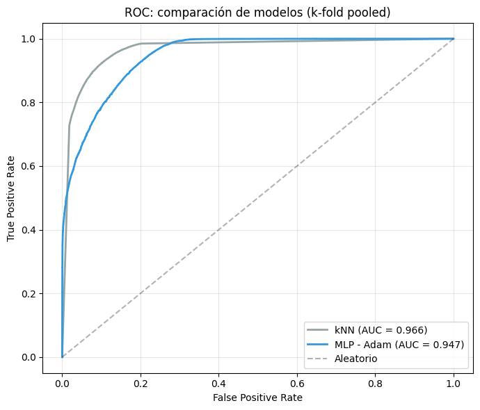

**Integrantes y carnes**

| Integrante | Carne |
|---|---:|
| Daniel Garbanzo | 2022117129 |
| Luis Carlos Navarro Todd | 2022212158 |
| Ricardo Shum Estrada | 2017144193 |

**Algoritmo:** MLP con Adam como optimizador   
**Dataset:** Historial de trabajos del clúster Kabré de CeNAT/CONARE  
**Fuente del dataset:** `new_dataset.csv`, historial extendido usado en `mlp_adam.ipynb`  
**Entregable base:** `mlp_adam.ipynb`

# 1. Introducción
Los clústeres de cómputo de alto rendimiento (HPC) son infraestructuras compartidas donde muchos usuarios envían trabajos con requerimientos variables de CPUs, memoria, nodos, prioridad, tiempo límite y colas de ejecución (Benavides et al., 2025). En este entorno, una configuración inadecuada no solo incrementa la probabilidad de fallo, sino que también consume recursos de cómputo, tiempo de cola y esfuerzo de investigación sin producir un resultado útil. En Kabré, operado por CeNAT/CONARE, este problema tiene relevancia directa porque la distribución inicial del notebook muestra que `FAILED` representa **49.80%** de los trabajos.

El objetivo de este proyecto fue construir, desde cero, un modelo clasificador binario utilizando la arquitectura de MLP y compararlo con una línea base obtenida al reutilizar la implementación de k-Nearest Neighbors (kNN) del primer proyecto bajo el nuevo conjunto de datos y el mismo protocolo de validación. La pregunta que guió el trabajo fue la siguiente: **"¿Es posible predecir con precisión razonable si un trabajo en el clúster Kabré se completará exitosamente y qué enfoque funciona mejor, kNN re-evaluado sobre el dataset extendido o un MLP entrenado con Adam?"**

Se eligió MLP como modelo de aprendizaje profundo por su capacidad de aproximar funciones no lineales complejas y por su flexibilidad para incorporar múltiples capas y neuronas, lo que permite capturar interacciones entre las variables de entrada que podrían ser relevantes para la predicción del éxito o fracaso de un trabajo. Por otro lado, kNN fue seleccionado como referencia debido a su simplicidad y efectividad en problemas de clasificación, sirviendo como un punto de comparación para evaluar el desempeño del MLP.

El informe se organiza siguiendo una lógica compatible con CRISP-DM: contexto del problema, entendimiento de los datos, preparación, modelado, evaluación y conclusiones. El notebook base contiene la implementación y las salidas experimentales; este reporte sintetiza ese proceso con énfasis en la implementación algebraica del modelo, los hallazgos del análisis exploratorio, el desempeño comparativo del clasificador y la interpretación crítica de sus limitaciones metodológicas.


# 2. Marco teórico

## 2.1 Función de pérdida

Una función de pérdida (*loss function*) cuantifica la diferencia entre la salida predicha por un modelo y el valor real esperado. En el contexto de machine learning, el entrenamiento de un modelo consiste en encontrar los parámetros $\theta$ que minimizan el valor promedio de la función de pérdida sobre el conjunto de entrenamiento (Goodfellow, Bengio, & Courville, 2016):

$$
J(\theta) = \frac{1}{n}\sum_{i=1}^{n} L\big(y_i, \hat{y}_i(\theta)\big)
$$

La elección de la función de pérdida depende de la naturaleza del problema. Para tareas de clasificación binaria, como la utilizada en este proyecto, la pérdida de entropía cruzada es la más utilizada, ya que penaliza con mayor fuerza las predicciones incorrectas:

$$
L_{CE}(y, \hat{y}) = -\frac{1}{n}\sum_{i=1}^{n}\Big[y_i \log(\hat{y}_i) + (1-y_i)\log(1-\hat{y}_i)\Big]
$$

La función de pérdida no solo mide el desempeño del modelo; también define la superficie sobre la cual operan los algoritmos de optimización, de modo que su forma (convexa, no convexa, diferenciable) condiciona directamente la dificultad del proceso de entrenamiento (Bishop, 2006).

## 2.2 Funciones de activación

Las funciones de activación introducen no linealidad en la salida de cada neurona artificial. Sin ellas, una red de múltiples capas se reduciría algebraicamente a una única transformación lineal, sin capacidad de modelar relaciones complejas entre las variables de entrada y la salida (Goodfellow et al., 2016).

Históricamente, la función sigmoide y la tangente hiperbólica fueron las primeras en utilizarse de forma extendida:

$$
\sigma(z) = \frac{1}{1+e^{-z}}, \qquad \tanh(z) = \frac{e^{z}-e^{-z}}{e^{z}+e^{-z}}
$$

Ambas comprimen su entrada en un rango acotado, pero presentan gradientes muy pequeños cuando $|z|$ es grande, lo que dificulta el entrenamiento de redes profundas mediante el fenómeno conocido como desaparición del gradiente (*vanishing gradient*) (Glorot & Bengio, 2010). Como respuesta a esta limitación, se popularizó la unidad lineal rectificada (ReLU):

$$
f(z) = \max(0, z)
$$

La ReLU mantiene un gradiente constante para valores positivos de $z$, lo que acelera la convergencia del entrenamiento en arquitecturas profundas y reduce el costo computacional respecto a funciones exponenciales (Nair & Hinton, 2010). La selección de la función de activación afecta tanto la expresividad del modelo como la estabilidad numérica del proceso de backpropagation descrito más adelante.

## 2.3 Momentos estadísticos en el contexto de machine learning

Dentro del entrenamiento de redes neuronales, los momentos estadísticos ayudan a estimar de manera más eficiente los gradientes. En optimizadores adaptativos como Adam, se estiman en línea el primer momento (la media de los gradientes) y el segundo momento (la media de los gradientes al cuadrado, una medida de varianza no centrada) para ajustar dinámicamente la magnitud de cada actualización de los parámetros (Kingma & Ba, 2015). De esta manera, un concepto puramente estadístico se traduce en un mecanismo práctico de control de la velocidad y estabilidad del aprendizaje.

## 2.4 Redes neuronales y perceptrón multicapa

El perceptrón, propuesto originalmente como un modelo simplificado de neurona biológica, calcula una combinación lineal de sus entradas seguida de una función de activación (Rosenblatt, 1958):

$$
\hat{y} = f(w^T x + b)
$$

Un perceptrón individual solo puede separar clases linealmente separables; Minsky y Papert (1969) demostraron formalmente que un único perceptrón no puede representar funciones tan simples como la disyunción exclusiva (XOR). Esta limitación motivó el desarrollo del perceptrón multicapa (*Multilayer Perceptron*, MLP), una red neuronal compuesta por una o más capas ocultas entre la entrada y la salida.

En un MLP, la activación de la capa $l$ se obtiene a partir de la capa anterior mediante:

$$
z^{(l)} = W^{(l)} a^{(l-1)} + b^{(l)}, \qquad a^{(l)} = f\big(z^{(l)}\big)
$$

donde $W^{(l)}$ y $b^{(l)}$ son la matriz de pesos y el vector de sesgos de la capa $l$, y $f$ es la función de activación correspondiente. Apilar varias de estas transformaciones permite que la red aproxime funciones no lineales complejas (Hornik, Stinchcombe, & White, 1989). Esta capacidad de composición es lo que distingue a las redes neuronales profundas de los modelos lineales clásicos (Haykin, 2009).

## 2.5 Backpropagation

El algoritmo de retropropagación del error (*backpropagation*) permite calcular de manera eficiente el gradiente de la función de pérdida respecto a todos los parámetros de una red neuronal, aplicando sistemáticamente la regla de la cadena desde la capa de salida hacia las capas anteriores (Rumelhart, Hinton, & Williams, 1986).

Para la capa de salida $L$, el error se define como:

$$
\delta^{(L)} = \nabla_{a} L \;\odot\; f'\big(z^{(L)}\big)
$$

donde $\odot$ denota el producto elemento a elemento. Para cualquier capa oculta $l$, el error se propaga hacia atrás utilizando los pesos de la capa siguiente:

$$
\delta^{(l)} = \big(W^{(l+1)}\big)^{T}\,\delta^{(l+1)} \;\odot\; f'\big(z^{(l)}\big)
$$

Una vez calculados los términos $\delta^{(l)}$, el gradiente respecto a los pesos de cada capa se obtiene directamente como:

$$
\frac{\partial J}{\partial W^{(l)}} = \delta^{(l)} \big(a^{(l-1)}\big)^{T}
$$

Este procedimiento evita recalcular derivadas redundantes capa por capa, lo que reduce drásticamente el costo computacional frente a un cálculo numérico ingenuo o de fuerza bruta del gradiente, y es la base sobre la cual operan prácticamente todos los algoritmos modernos de entrenamiento de redes neuronales (Goodfellow et al., 2016; LeCun, Bengio, & Hinton, 2015).

## 2.6 Adam como optimizador

Adam (*Adaptive Moment Estimation*) es un algoritmo de optimización basado en gradiente que combina dos ideas previas: el momentum, que acumula una media móvil de los gradientes para suavizar la trayectoria de descenso, y la adaptación de la tasa de aprendizaje por parámetro, inspirada en algoritmos como RMSProp (Kingma & Ba, 2015).

En cada iteración $t$, Adam actualiza dos estimadores exponenciales: el primer momento $m_t$ (media de los gradientes) y el segundo momento $v_t$ (media de los gradientes al cuadrado):

$$
m_t = \beta_1 m_{t-1} + (1-\beta_1)\,g_t, \qquad v_t = \beta_2 v_{t-1} + (1-\beta_2)\,g_t^{2}
$$

Dado que estos estimadores están sesgados hacia cero en las primeras iteraciones, Adam aplica una corrección de sesgo:

$$
\hat{m}_t = \frac{m_t}{1-\beta_1^{t}}, \qquad \hat{v}_t = \frac{v_t}{1-\beta_2^{t}}
$$

Finalmente, los parámetros se actualizan utilizando ambos momentos corregidos:

$$
\theta_t = \theta_{t-1} - \frac{\eta}{\sqrt{\hat{v}_t}+\epsilon}\,\hat{m}_t
$$

donde $\eta$ es la tasa de aprendizaje y $\epsilon$ es una constante pequeña que evita divisiones por cero. Los valores recomendados por los autores originales son $\beta_1 = 0.9$, $\beta_2 = 0.999$ y $\epsilon = 10^{-8}$ (Kingma & Ba, 2015). Gracias a esta combinación de momentum y escalamiento adaptativo, Adam suele converger más rápido y de forma más estable que el descenso de gradiente estocástico clásico en arquitecturas profundas, lo que explica su adopción generalizada como optimizador por defecto en la práctica moderna de deep learning (Goodfellow et al., 2016).

# 3. Descripción del dataset
## 3.1 Origen y Contexto del Dataset
El conjunto de datos experimental que se utilizó fue el
registro de trabajos de la herramienta SLURM en el clúster
de cómputo Kabré desde junio de 2024 hasta junio de 2026.
El clúster contaba con 5 particiones con arquitecturas distintas,
Andalan, Dribe, Kurá, Nu y Nukwa. También, hay sub-particiones para diferentes propósitos como trabajos largos con
long, trabajos multi-nodo con wide o trabajos para depuración
debug.

## 3.2 Variables y Objetivo de Clasificación
Los registros tenían 12 diferentes variables. Algunas variables son mediciones que el sistema
toma después del trabajo como el tiempo de CPU utilizado, la
energía total consumida y el estado final del trabajo. Estas
variables no son conocidas antes de enviar el trabajo, por
lo tanto, se pueden usar como variables objetivo usando
diferentes modelos de regresión o clasificación. En el contexto
de esta investigación, el estado final del trabajo es la variable
objetivo, ya que intentamos modelar si un trabajo va a tener
de estado final 'COMPLETED' o no. El resto de variables se
definen al enviar el trabajo incluyendo el número solicitado
de CPUs, la memoria, el número de nodos, el tiempo de CPU
reservado, la marca de tiempo de envío, el límite de tiempo
del trabajo, la partición del clúster por usar, la prioridad, y la
clase de calidad de servicio (QOS).

El conjunto de datos cuenta con **229,466 registros** de
trabajos del clúster. Inicialmente se trabajó con set de datos
desbalanceado, con los datos entre 2024 y 2025. Se tenía un
desbalance en la distribución ya que solo un 35.9 % de los
trabajos tenían estado 'COMPLETED'. Este desbalance de
14 % comparado con el resto de estados es bastante grande, sin
embargo, evidencia el comportamiento natural de un clúster
con usuarios variados. A pesar de que el desbalance refleja de
manera más fiel la proporción de trabajos completados contra
trabajos fallidos, se consiguió una extensión del conjunto de
datos original para aumentar la calidad de datos utilizados
para el entrenamiento, contando con los datos hasta inicios de junio de 2026. El nuevo conjunto de datos tiene 41.8% de trabajos con estado 'COMPLETED' y 49.2% con estado 'FAILED', lo que reduce el desbalance a un 8.2 % y mejora la representatividad de los datos para el entrenamiento del modelo.

## 3.3 Limpieza y Preprocesamiento

Antes de construir las matrices de características, el dataset requirió eliminar valores nulos y registros duplicados. Tras la carga inicial, el conjunto presenta **12,516 valores nulos** concentrados en la columna `ConsumedEnergyRaw` (12,394 nulos, 5.40 % de los registros), y **11,258 filas duplicadas** (4.91 %). Luego de eliminar ambos tipos de registros, el conjunto queda en **207,050 filas** utilizables sin datos faltantes ni repetidos.

| Indicador | Valor |
|---|---:|
| Registros brutos | 229,466 |
| Nulos originales (total) | 12,516 |
| Duplicados originales | 11,258 |
| Registros finales utilizables | 207,050 |

La siguiente tabla resume las variables más relevantes y su tratamiento en el pipeline:

| Variable | Tipo original | Tratamiento en el notebook | Uso final |
|---|---|---|---|
| `ReqCPUS` | Numerica | Se conserva | Feature numerica |
| `ReqMem` | Cadena | Se convierte a `ReqMem_MB` | Feature numerica |
| `ReqNodes` | Numerica | Se conserva | Feature numerica |
| `ResvCPURAW` | Numerica | Se conserva | Feature numerica |
| `TimelimitRaw` | Mixta | Se transforma a `TimelimitSec` | Feature numerica |
| `Priority` | Numerica | Se conserva | Feature numerica |
| `Submit` | Fecha-hora | Se derivan `submit_hour` y `submit_dow` | Features temporales |
| `Partition` | Categorica | Se agrupa como `PartitionGroup` | One-hot encoding |
| `QOS` | Categorica | Se conserva | One-hot encoding |
| `State` | Categorica | Se binariza en `COMPLETED` vs no completado | Variable objetivo |

La columna `ConsumedEnergyRaw`, aunque presente en el dataset, no se incorpora como feature de entrada porque registra energía consumida durante la ejecución, dato que no está disponible al momento de enviar el trabajo.

## 3.4 Hallazgos principales del análisis exploratorio

El EDA realizado en el notebook revela varios patrones relevantes para el modelado:

- La distribución de la variable objetivo muestra un desbalance moderado: `COMPLETED` representa el 41.8 % de los registros y `FAILED` el 49.2 %, con una diferencia de 8.2 puntos porcentuales. Esto mejora sustancialmente la representatividad de los datos respecto al conjunto original de 2024, donde el desbalance era de 14 puntos.
- La tasa de éxito varía de forma significativa entre particiones, lo que confirma que `PartitionGroup` aporta información discriminativa para la clasificación.
- Existen patrones temporales tanto por hora del día como por día de la semana en el envío de trabajos, lo que justifica derivar `submit_hour` y `submit_dow` a partir de la columna `Submit`.
- Las variables numéricas presentan alta dispersión y valores atípicos: `CPUTimeRAW` y `ReqCPUS` tienen tasas de outliers (criterio IQR) del 19.29 % y 15.21 % respectivamente. Estos valores no se eliminaron porque reflejan comportamientos plausibles en un entorno HPC real.
- La matriz de correlación entre variables numéricas y `completed_bin` no muestra correlaciones lineales fuertes, lo que sugiere que las relaciones predictivas son en su mayoría no lineales: una motivación directa para usar MLP en lugar de modelos lineales.

# 4. Implementación

La implementación del MLP se realizó íntegramente en Python usando NumPy. Se evitó el uso de frameworks como PyTorch o Keras para los componentes del modelo: la función de pérdida, las funciones de activación, el algoritmo de backpropagation y el optimizador Adam se codificaron desde cero como funciones y clases puras. La biblioteca `scikit-learn` se usó únicamente para la división estratificada del dataset (`StratifiedKFold`) y la normalización min-max (`MinMaxScaler`), operaciones auxiliares que no forman parte del algoritmo principal.

## 4.1 Construcción de la matriz de características

A partir del dataset limpio, el notebook construye una matriz `X` con **207,050 muestras** y **16 dimensiones efectivas**, junto con un vector de etiquetas `y` del mismo tamaño. Cada trabajo se representa mediante un vector que combina:

- **8 variables numéricas:** `ReqCPUS`, `ReqMem_MB`, `ReqNodes`, `ResvCPURAW`, `TimelimitSec`, `Priority`, `submit_hour`, `submit_dow`
- Las columnas one-hot de `PartitionGroup` (5 familias: Andalan, Dribe, Kura, Nu, Nukwa)
- Las columnas one-hot de `QOS` (3 clases: normal, high, max-jobs)

Formalmente, cada trabajo queda representado como un vector $x \in \mathbb{R}^{16}$. Este paso traduce información heterogénea del scheduler en una estructura algebraica apta para operaciones matriciales dentro del MLP.

## 4.2 División y normalización del dataset

Se utiliza validación cruzada con **5 folds** estratificados (`StratifiedKFold`, `random_state=42`), preservando la distribución de clases en cada partición. La normalización min-max se aplica **dentro de cada fold**: el escalador se ajusta únicamente sobre los datos de entrenamiento y luego se aplica al conjunto de validación:

$$
x' = \frac{x - x_{\min}^{\text{train}}}{x_{\max}^{\text{train}} - x_{\min}^{\text{train}}}
$$

Este procedimiento evita *data leakage*, ya que el escalador nunca accede a información del conjunto de validación durante su ajuste. Es especialmente importante para kNN, cuyas distancias dependen directamente de la escala de las features.

## 4.3 Implementación desde cero del MLP

La clase `MLP` implementa un perceptrón multicapa totalmente conectado para clasificación binaria. La arquitectura utilizada es `[16, 64, 32, 1]`: capa de entrada de 16 neuronas, dos capas ocultas de **64** y **32** neuronas con activación ReLU, y capa de salida de una neurona con activación sigmoide.

Los pesos se inicializan mediante la **inicialización He** (Kaiming), apropiada para redes con activaciones ReLU:

$$
W^{(l)} \sim \mathcal{N}\!\left(0,\; \sqrt{\tfrac{2}{n_{\text{in}}^{(l)}}}\right)
$$

donde $n_{\text{in}}^{(l)}$ es el número de entradas de la capa $l$. Esta escala preserva la varianza de las activaciones a través de las capas, facilitando la convergencia. Los sesgos se inicializan en cero.

### Forward pass

En cada paso hacia adelante, la activación de la capa $l$ se calcula como:

$$
Z^{(l)} = A^{(l-1)} W^{(l)} + b^{(l)}, \qquad A^{(l)} = f\!\left(Z^{(l)}\right)
$$

donde $f$ es ReLU para las capas ocultas y sigmoide para la capa de salida. La multiplicación $A^{(l-1)} W^{(l)}$ opera sobre el mini-lote completo: $A^{(l-1)}$ tiene forma $(m, n_{\text{in}}^{(l)})$ y $W^{(l)}$ tiene forma $(n_{\text{in}}^{(l)}, n_{\text{out}}^{(l)})$, produciendo $Z^{(l)}$ de forma $(m, n_{\text{out}}^{(l)})$. Las pre-activaciones $Z^{(l)}$ y las activaciones $A^{(l)}$ se almacenan en caché para el backward pass.

### Backward pass

El gradiente de la función de pérdida respecto a los parámetros de cada capa se calcula mediante backpropagation. Para la capa de salida se aprovecha la simplificación algebraica de la derivada conjunta de BCE y sigmoide, que resulta numéricamente estable:

$$
\frac{\partial J}{\partial Z^{(L)}} = \frac{A^{(L)} - y}{m}
$$

Para las capas ocultas, el error retropropaga hacia atrás mediante:

$$
\delta^{(l)} = \left(\delta^{(l+1)} \left(W^{(l+1)}\right)^T\right) \odot f'\!\left(Z^{(l)}\right)
$$

y los gradientes respecto a pesos y sesgos se obtienen como:

$$
\frac{\partial J}{\partial W^{(l)}} = \left(A^{(l-1)}\right)^T \delta^{(l)}, \qquad \frac{\partial J}{\partial b^{(l)}} = \sum_{i=1}^{m} \delta^{(l)}_i
$$

### Optimizador Adam

Tras calcular los gradientes, la actualización de parámetros sigue el algoritmo Adam implementado manualmente. En el paso $t$, para cada parámetro $\theta$ (peso o sesgo) con gradiente $g_t$:

$$
m_t = \beta_1 m_{t-1} + (1-\beta_1)\,g_t, \qquad v_t = \beta_2 v_{t-1} + (1-\beta_2)\,g_t^{2}
$$

$$
\hat{m}_t = \frac{m_t}{1-\beta_1^{t}}, \qquad \hat{v}_t = \frac{v_t}{1-\beta_2^{t}}
$$

$$
\theta_t = \theta_{t-1} - \frac{\eta}{\sqrt{\hat{v}_t}+\epsilon}\,\hat{m}_t
$$

Los hiperparámetros utilizados son $\eta = 0.001$, $\beta_1 = 0.9$, $\beta_2 = 0.999$ y $\epsilon = 10^{-8}$, los valores recomendados por Kingma & Ba (2015). El estado de Adam (los momentos $m_t$ y $v_t$ para cada parámetro) se inicializa en cero al comienzo del entrenamiento y se mantiene entre pasos. Todas las operaciones se realizan sobre matrices completas, actualizando simultáneamente todos los parámetros de cada capa mediante operaciones vectorizadas de NumPy.

## 4.4 Ciclo de entrenamiento

El modelo se entrena durante **50 épocas** con mini-lotes de **128 muestras**. En cada época, el dataset se mezcla aleatoriamente antes de particionar en mini-lotes. El ciclo por mini-lote es: forward pass → cálculo de pérdida BCE → backward pass → paso Adam.

## 4.5 Baseline: kNN del Proyecto 1

Como modelo de referencia se utiliza la implementación de kNN desarrollada en el Proyecto 1. La configuración empleada es `k=5`, distancia euclidiana y votación ponderada por distancia (`weighted=True`). Ambos modelos se evalúan sobre los mismos 5 folds con la misma normalización, lo que garantiza una comparación directa y justa.

## 4.6 Pseudocódigo del pipeline principal

```text
Entrada: dataset de trabajos del cluster Kabre (new_dataset.csv)
Salida: métricas comparativas de MLP-Adam y kNN

1.  Cargar dataset y parsear tipos de columnas
2.  Aplicar parse_reqmem (ReqMem -> ReqMem_MB) y parse_timelimit (TimelimitRaw -> TimelimitSec)
3.  Limpiar valores nulos y registros duplicados (207,050 registros finales)
4.  Agrupar Partition en familias (PartitionGroup) y derivar submit_hour, submit_dow
5.  Construir la matriz X (207050 × 16) y el vector y binario mediante build_features()
6.  Para cada fold en StratifiedKFold(k=5):
    6.1  Ajustar MinMaxScaler solo sobre X_train; transformar X_train y X_val
    6.2  Instanciar MLP([16, 64, 32, 1]) con inicialización He
    6.3  Para cada época (50 en total):
         a. Mezclar X_train e y_train aleatoriamente
         b. Para cada mini-lote de tamaño 128:
            i.  Forward pass: Z^(l) = A^(l-1) W^(l) + b^(l), A^(l) = f(Z^(l))
            ii. Calcular pérdida BCE
            iii.Backward pass: calcular gradientes con regla de la cadena
            iv. Paso Adam: actualizar pesos y sesgos con momentos corregidos
    6.4  Instanciar KNNClassifier(k=5, euclidean, weighted=True) y ajustar sobre X_train
    6.5  Predecir sobre X_val con ambos modelos
    6.6  Calcular accuracy, precision, recall, F1-score y AUC-ROC
7.  Agregar métricas de los 5 folds (media ± desviación estándar)
8.  Graficar comparación de métricas y curvas ROC pooled
```

## 4.7 Fragmentos clave con anotaciones

### Inicialización He de los pesos

```python
def he_init(n_in, n_out, rng):
    return rng.standard_normal((n_in, n_out)) * np.sqrt(2.0 / n_in)
```

La escala $\sqrt{2/n_{\text{in}}}$ compensa la media truncada de ReLU, preservando la varianza de las activaciones a lo largo de las capas y facilitando la convergencia.

### Forward pass vectorizado

```python
Z = current_activation @ self.W[i] + self.b[i]
if i < self.n_layers - 1:
    current_activation = relu(Z)
else:
    current_activation = sigmoid(Z)
```

La multiplicación matricial procesa todo el mini-lote en una sola operación. El sesgo se suma por broadcasting sobre la dimensión de lote.

### Simplificación del gradiente en la capa de salida

```python
y_pred = activations[-1]
dZ = (y_pred - y_true) / m
```

La derivada combinada de BCE y sigmoide se reduce a esta expresión directa, evitando divisiones por probabilidades pequeñas que causarían inestabilidad numérica.

### Paso Adam vectorizado

```python
self.mW[layer] = beta1 * self.mW[layer] + (1 - beta1) * gW
self.vW[layer] = beta2 * self.vW[layer] + (1 - beta2) * (gW ** 2)
m_hat = self.mW[layer] / bc1
v_hat = self.vW[layer] / bc2
self.W[layer] -= lr * m_hat / (np.sqrt(v_hat) + epsilon)
```

Todas las operaciones actúan sobre matrices completas, actualizando simultáneamente cada elemento de la capa sin necesidad de loops.


# 5. Resultados y análisis

## 5.1 Comparación por validación cruzada

La evaluación principal utilizó `StratifiedKFold(n_splits=5, shuffle=True, random_state=42)`, es decir, validación cruzada estratificada de **5 pliegues** (*folds*). El uso de pliegues estratificados fue importante porque la clase positiva `COMPLETED` no representa la mayoría absoluta del conjunto de datos. De esta forma, cada partición de validación mantuvo una proporción semejante de trabajos completados y no completados.

El desempeño observado por pliegue fue el siguiente:

| Pliegue | Modelo | Accuracy | F1-score | AUC-ROC |
|---:|---|---:|---:|---:|
| 1 | kNN | 0.9076 | 0.8991 | 0.9662 |
| 1 | MLP - Adam | 0.8610 | 0.8568 | 0.9479 |
| 2 | kNN | 0.9113 | 0.9034 | 0.9657 |
| 2 | MLP - Adam | 0.8563 | 0.8513 | 0.9466 |
| 3 | kNN | 0.9105 | 0.9021 | 0.9662 |
| 3 | MLP - Adam | 0.8603 | 0.8538 | 0.9486 |
| 4 | kNN | 0.9094 | 0.9012 | 0.9649 |
| 4 | MLP - Adam | 0.8534 | 0.8430 | 0.9454 |
| 5 | kNN | 0.9115 | 0.9032 | 0.9680 |
| 5 | MLP - Adam | 0.8624 | 0.8556 | 0.9486 |

El resumen agregado muestra que ambos modelos obtienen métricas claramente superiores al clasificador de clase mayoritaria:

| Métrica | kNN | MLP - Adam |
|---|---:|---:|
| Accuracy | 0.9101 ± 0.0014 | 0.8587 ± 0.0034 |
| Precision | 0.9047 ± 0.0022 | 0.8205 ± 0.0071 |
| Recall | 0.8989 ± 0.0025 | 0.8865 ± 0.0160 |
| F1-score | 0.9018 ± 0.0016 | 0.8521 ± 0.0049 |
| AUC-ROC | 0.9662 ± 0.0010 | 0.9474 ± 0.0012 |

{fig-cap="Comparación de métricas promedio en validación cruzada." width=92%}

## 5.2 Interpretación de las métricas

El baseline mínimo para este experimento es un clasificador de clase mayoritaria. A partir de `y_raw`, después de la limpieza usada para modelado, los trabajos no completados representan aproximadamente **54.07%** del conjunto efectivo. Por lo tanto, cualquier modelo útil debe superar de forma clara una precisión cercana a 0.5407. El MLP con Adam alcanza **0.8587** de accuracy promedio, lo que representa una mejora absoluta de aproximadamente **0.3180** puntos respecto a ese baseline ingenuo.

Sin embargo, la comparación directa muestra que el kNN supera al MLP en todas las métricas agregadas. La diferencia promedio es de **0.0514** puntos en accuracy, **0.0497** puntos en F1-score y **0.0188** puntos en AUC-ROC. Este resultado sugiere que, bajo este protocolo, un modelo más flexible como una red neuronal no necesariamente supera a un método basado en vecindad. Una hipótesis no evaluada directamente en el notebook es que la geometría local de las variables normalizadas del planificador favorece a kNN frente a la función no lineal aprendida por el MLP bajo la configuración evaluada.

El MLP presenta un comportamiento particularmente interesante: su `recall` promedio es alto (**0.8865**), pero su `precision` promedio es menor (**0.8205**). Esto indica que el modelo recupera una fracción grande de los trabajos que efectivamente se completan; además, su menor `precision` es compatible con una mayor proporción de falsos positivos entre las predicciones positivas. En el contexto de un clúster HPC, este patrón debe interpretarse con cautela: un falso positivo puede llevar a comunicar una probabilidad de éxito excesivamente optimista para un trabajo que finalmente falla.

El AUC-ROC del MLP (**0.9474**) sigue siendo alto. Esto significa que, aun cuando su umbral fijo de 0.5 no produce el mejor clasificador final frente a kNN, las puntuaciones del MLP separan las clases mejor que un clasificador aleatorio. Por esa razón, el MLP no debe descartarse como modelo inútil; más bien, el hallazgo correcto es que, con la arquitectura e hiperparámetros usados en el notebook, no supera al kNN como clasificador final para este dataset.

{fig-cap="Curvas ROC comparativas para kNN y MLP-Adam." width=75%}

## 5.3 Hallazgos principales

Los hallazgos del experimento pueden sintetizarse en cuatro puntos:

1. El dataset extendido permite entrenar clasificadores que superan ampliamente el baseline de clase mayoritaria a partir de la matriz de características construida en el notebook.
2. El MLP con Adam logra un desempeño sólido y estable entre pliegues, con desviaciones estándar pequeñas en accuracy, F1-score y AUC-ROC. Por lo tanto, su resultado es consistente entre particiones de validación bajo el protocolo usado.
3. El kNN mantiene ventaja empírica sobre el MLP en este experimento. Una hipótesis, no evaluada directamente en el notebook, es que la estructura local de las variables normalizadas favorece a un método basado en vecinos cercanos.
4. La red neuronal conserva valor analítico porque implementa explícitamente optimización por gradiente, backpropagation y momentos adaptativos. Desde la perspectiva del curso, el MLP permite estudiar el proceso de entrenamiento de forma más rica que kNN, aunque su desempeño final sea menor.

## 5.4 Limitaciones metodológicas

La comparación debe leerse como evidencia empírica del notebook y no como una demostración definitiva de superioridad de un modelo sobre otro. El MLP se evaluó con una sola arquitectura principal, una tasa de aprendizaje fija y 50 épocas por pliegue; no se documenta una búsqueda sistemática de hiperparámetros, regularización, `early stopping` ni calibración del umbral de decisión. Además, el notebook no reporta matriz de confusión ni curvas precision-recall para el MLP, por lo que el análisis de falsos positivos y falsos negativos queda inferido a partir de `precision` y `recall`.

Una segunda limitación proviene de la limpieza: el notebook aplica `dropna()` sobre el dataframe completo, incluyendo columnas que luego no se usan como predictores finales. En consecuencia, se descartan registros con valores faltantes en métricas posteriores a la ejecución, como `ConsumedEnergyRaw`, aunque esa variable no forma parte de la matriz `X`. Para una versión posterior, sería más preciso restringir la eliminación de nulos a las columnas necesarias para construir las características y la etiqueta.

También debe considerarse que las correlaciones lineales individuales con `completed_bin` son débiles: `Priority` alcanza 0.0967 y `TimelimitSec` -0.0641, mientras que las demás variables quedan cerca de cero. Esto no invalida el modelo, porque tanto kNN como MLP pueden capturar relaciones no lineales o interacciones entre variables, pero sí refuerza la necesidad de interpretar el desempeño como resultado de patrones multivariados y no de una única variable dominante.

También existe una limitación específica en la construcción de `TimelimitSec`: el parser evalúa algunas particiones generales antes que sus subparticiones. Por ejemplo, una coincidencia con `nukwa` puede ocurrir antes de distinguir `nukwa-debug` o `nukwa-long`; el mismo patrón puede afectar familias como `dribe`, `kura`, `andalan` y `nu`. Dado que `TimelimitSec` sí entra en la matriz de características, esta regla puede introducir ruido en una variable predictiva y convendría corregir el orden de evaluación en una versión posterior del notebook.

Otra observación del EDA es la presencia de valores extremos. El notebook reporta proporciones altas de outliers por IQR en `CPUTimeRAW` (19.29%) y `ReqCPUS` (15.21%), además de outliers en `Priority` (5.09%), `ReqMem_MB` (3.93%) y `TimelimitSec` (2.78%). Estos valores no necesariamente son errores, porque pueden representar trabajos HPC legítimos, pero sí son consistentes con distribuciones de recursos heterogéneas y con colas pesadas.

# 6. Conceptos del curso aplicados

## 6.1 Función de pérdida y estabilidad numérica

El entrenamiento del MLP minimiza la entropía cruzada binaria:

$$
L(y,\hat{y}) = -\frac{1}{n}\sum_{i=1}^{n}\left[y_i\log(\hat{y}_i) + (1-y_i)\log(1-\hat{y}_i)\right]
$$

Esta función es apropiada porque la salida del modelo es una probabilidad sigmoidal para una tarea de clasificación binaria. En la implementación se aplica `np.clip` sobre las probabilidades predichas, restringiéndolas al intervalo $[\epsilon, 1-\epsilon]$ con $\epsilon = 10^{-8}$. Este detalle conecta directamente con programación numérica: sin ese recorte, predicciones exactamente iguales a 0 o 1 producirían logaritmos indefinidos y valores no finitos durante el entrenamiento.

## 6.2 Representación matricial del perceptrón multicapa

Cada capa del MLP aplica una transformación afín seguida de una activación:

$$
Z^{(l)} = A^{(l-1)}W^{(l)} + b^{(l)}, \qquad A^{(l)} = f(Z^{(l)})
$$

En el notebook, esta operación se implementa con multiplicación matricial vectorizada mediante `@`. La primera matriz de pesos transforma las 16 características del trabajo hacia 64 activaciones ocultas; la segunda transforma 64 activaciones en 32; y la última transforma 32 activaciones en una probabilidad escalar. Esta formulación muestra de manera explícita cómo un problema operativo del clúster se convierte en una composición de operadores algebraicos.

## 6.3 Activaciones e inicialización He

Las capas ocultas usan ReLU:

$$
f(z)=\max(0,z)
$$

La capa final usa la función sigmoide:

$$
\sigma(z)=\frac{1}{1+e^{-z}}
$$

La elección de ReLU reduce el riesgo de gradientes extremadamente pequeños en las capas ocultas y evita el costo de funciones exponenciales en esas capas. La inicialización He, definida en el código como una normal escalada por $\sqrt{2/n_{in}}$, mantiene la varianza de las activaciones en un rango más estable al inicio del entrenamiento. Además, la sigmoide se evalúa con recorte de sus entradas entre -500 y 500 para evitar overflow numérico en `np.exp`.

## 6.4 Backpropagation y regla de la cadena

El cálculo de gradientes se implementó manualmente mediante backpropagation. Para la combinación de sigmoide en la salida y entropía cruzada binaria, el notebook utiliza la simplificación:

$$
\frac{\partial L}{\partial Z^{(L)}} = \frac{\hat{y}-y}{m}
$$

Luego, para cada capa se calculan los gradientes:

$$
\frac{\partial L}{\partial W^{(l)}} = \left(A^{(l-1)}\right)^T \frac{\partial L}{\partial Z^{(l)}},
\qquad
\frac{\partial L}{\partial b^{(l)}} = \sum_i \frac{\partial L}{\partial Z_i^{(l)}}
$$

Este procedimiento aplica la regla de la cadena desde la salida hacia la entrada y evita diferencias finitas, que serían más costosas e inestables para matrices con miles de parámetros.

## 6.5 Adam y momentos adaptativos

Adam se aplicó como algoritmo de optimización de primer orden. En cada mini-batch se actualizan dos acumuladores por parámetro:

$$
m_t = \beta_1m_{t-1} + (1-\beta_1)g_t, \qquad
v_t = \beta_2v_{t-1} + (1-\beta_2)g_t^2
$$

Luego se corrige el sesgo inicial de ambos estimadores:

$$
\hat{m}_t = \frac{m_t}{1-\beta_1^t}, \qquad
\hat{v}_t = \frac{v_t}{1-\beta_2^t}
$$

y se actualizan pesos y sesgos mediante:

$$
\theta_t = \theta_{t-1} - \eta\frac{\hat{m}_t}{\sqrt{\hat{v}_t}+\epsilon}
$$

En el notebook se usaron los valores estándar $\beta_1 = 0.9$, $\beta_2 = 0.999$, $\epsilon = 10^{-8}$ y $\eta = 0.001$. Adam está diseñado para ajustar la magnitud efectiva de cada parámetro según el historial de gradientes, lo cual busca estabilizar el entrenamiento frente a escalas y curvaturas distintas en la superficie de pérdida.

## 6.6 Validación cruzada y prevención de fuga de información

El experimento también aplica un concepto metodológico relevante: la normalización debe aprenderse solo con datos de entrenamiento. Por esa razón, el `MinMaxScaler` se ajustó dentro de cada pliegue y luego se aplicó al subconjunto de validación correspondiente. Esta decisión evita que estadísticas del conjunto de validación influyan indirectamente en el entrenamiento y mantiene la evaluación como una estimación más honesta del desempeño fuera de muestra.

# 7. Conclusiones

El notebook muestra que un MLP implementado desde cero con Adam puede aprender patrones predictivos útiles para estimar si un trabajo del clúster Kabré finalizará como `COMPLETED`. La red alcanzó `accuracy = 0.8587`, `F1-score = 0.8521` y `AUC-ROC = 0.9474` en validación cruzada estratificada, superando ampliamente el baseline de clase mayoritaria. Bajo este protocolo, la matriz de características construida en el notebook permitió entrenar un clasificador no trivial.

No obstante, el resultado comparativo favorece al kNN ponderado, que obtuvo mejores métricas agregadas en el mismo protocolo experimental. Por tanto, la conclusión principal no es que el aprendizaje profundo reemplace automáticamente al enfoque del primer proyecto, sino que el MLP aporta una implementación más rica desde el punto de vista de optimización numérica, mientras que kNN conserva mejor desempeño empírico para este conjunto tabular.

Como trabajo futuro, sería necesario realizar una búsqueda sistemática de hiperparámetros del MLP, incorporar regularización, evaluar calibración de probabilidades y reportar matrices de confusión por pliegue. Estas extensiones permitirían explorar si la brecha frente a kNN se reduce con otra configuración o si persiste bajo evaluaciones adicionales.

# 8. Referencias

Benavides, D., Quirós-Corella, F., Meneses, E. (2025). *Machine Learning for Predicting Job States and CPU Power on a Supercomputer*. 12th Latin American High Performance Computing Conference, CARLA 2025, Kingston, Jamaica. In-press.

Bishop, C. M. (2006). *Pattern recognition and machine learning*. Springer.

Glorot, X., & Bengio, Y. (2010). Understanding the difficulty of training deep feedforward neural networks. *Proceedings of the 13th International Conference on Artificial Intelligence and Statistics, 9*, 249-256.

Goodfellow, I., Bengio, Y., & Courville, A. (2016). *Deep learning*. MIT Press.

Hastie, T., Tibshirani, R., & Friedman, J. (2009). *The elements of statistical learning: Data mining, inference, and prediction* (2nd ed.). Springer. https://doi.org/10.1007/978-0-387-84858-7

Haykin, S. (2009). *Neural networks and learning machines* (3rd ed.). Pearson.

Hornik, K., Stinchcombe, M., & White, H. (1989). Multilayer feedforward networks are universal approximators. *Neural Networks, 2*(5), 359-366. https://doi.org/10.1016/0893-6080(89)90020-8

Kingma, D. P., & Ba, J. (2015). Adam: A method for stochastic optimization. *Proceedings of the 3rd International Conference on Learning Representations (ICLR 2015)*. https://arxiv.org/abs/1412.6980

LeCun, Y., Bengio, Y., & Hinton, G. (2015). Deep learning. *Nature, 521*(7553), 436-444. https://doi.org/10.1038/nature14539

Minsky, M., & Papert, S. (1969). *Perceptrons: An introduction to computational geometry*. MIT Press.

Nair, V., & Hinton, G. E. (2010). Rectified linear units improve restricted Boltzmann machines. *Proceedings of the 27th International Conference on Machine Learning (ICML-10)*, 807-814.

Rosenblatt, F. (1958). The perceptron: A probabilistic model for information storage and organization in the brain. *Psychological Review, 65*(6), 386-408. https://doi.org/10.1037/h0042519

Rumelhart, D. E., Hinton, G. E., & Williams, R. J. (1986). Learning representations by back-propagating errors. *Nature, 323*(6088), 533-536. https://doi.org/10.1038/323533a0